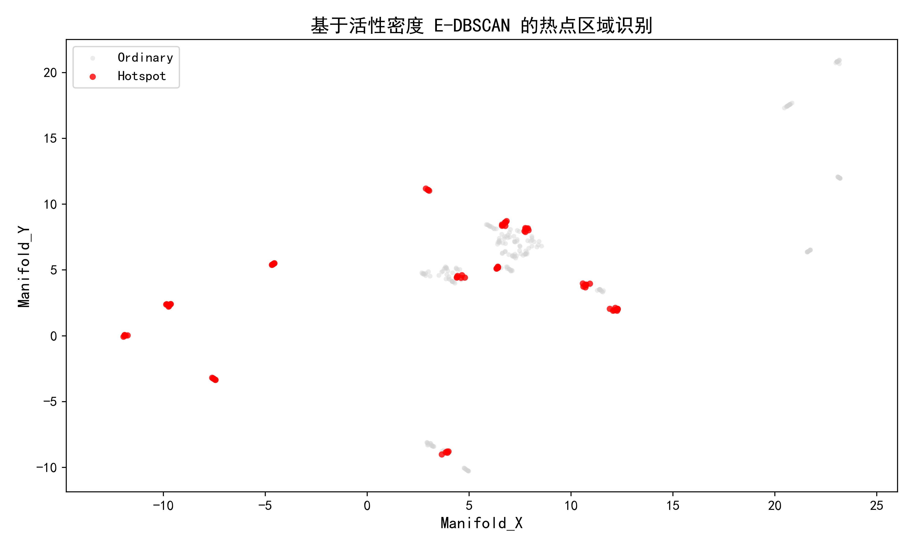
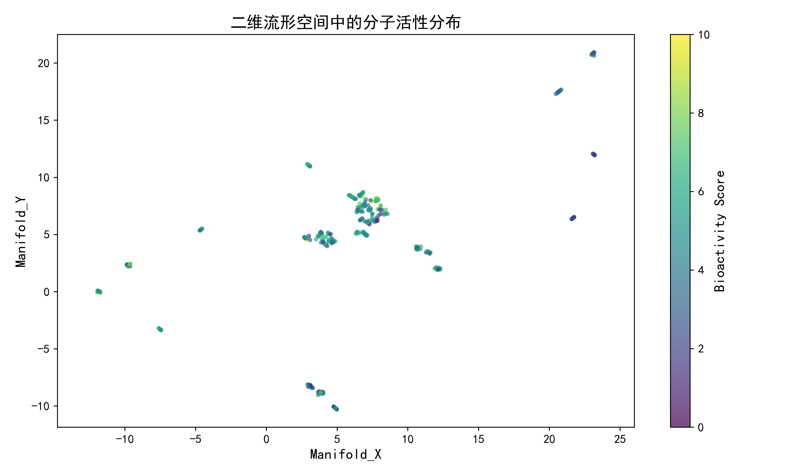
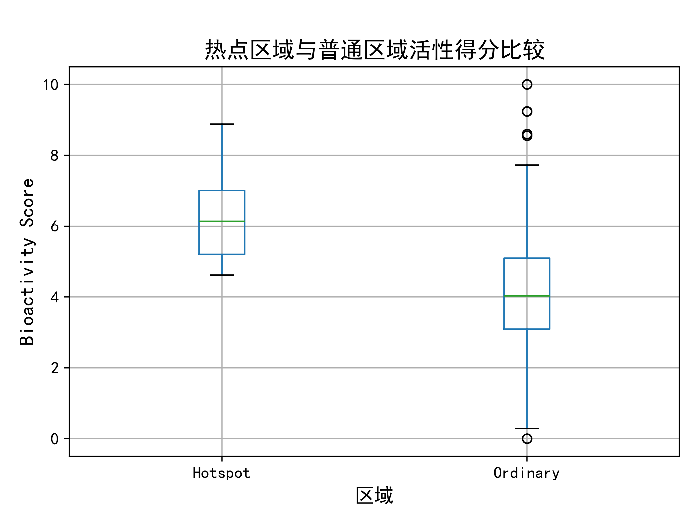

# 第一部分：问题一的求解

## 1.1 问题分析

问题一要求在分子二维流形空间中识别具有较高生物活性的热点区域，并进一步比较热点区域与普通区域在分子活性及若干理化性质上的差异。由于分子数据同时包含二维流形坐标 `Manifold_X`、`Manifold_Y` 以及生物活性得分 `Bioactivity_Score`，因此可将每个分子视为二维空间中的一个样本点，并以其生物活性作为样本属性。若某一区域内分子不仅空间位置相近，而且整体生物活性较高，则该区域可被视为高活性分子富集的热点区域。

传统 DBSCAN 聚类方法主要依据空间密度识别簇结构，但本题关注的并非单纯的空间聚集，而是“空间邻近性”与“生物活性富集性”的共同作用。因此，本文在 DBSCAN 思想基础上引入邻域活性密度指标，构建基于活性密度的 E-DBSCAN 方法，用于识别二维流形空间中的高活性热点区域。

## 1.2 数据预处理

首先读取附件 1 中的分子数据，并选取以下字段作为主要分析变量：

- 二维流形坐标：`Manifold_X`、`Manifold_Y`；
- 生物活性指标：`Bioactivity_Score`；
- 分子理化性质：`LogP`、`TPSA`、`MolWt`、`Dipole_Proxy`、`Max_Partial_Charge`、`Balaban_J`、`Bertz_CT`。

对上述数值型变量进行格式转换，并删除缺失 `Manifold_X`、`Manifold_Y` 或 `Bioactivity_Score` 的样本。经处理后，共得到 325 个有效分子样本。将第 $i$ 个分子的二维坐标记为

$$
X_i=(x_i,y_i),
$$

其生物活性得分记为

$$
A_i.
$$

## 1.3 基于活性密度的 E-DBSCAN 模型

### 1.3.1 邻域半径的自适应确定

为了避免人为指定邻域半径带来的主观性，本文采用第 8 近邻距离的中位数作为空间邻域半径。具体而言，对每个分子计算其第 8 个最近邻的距离，并取所有样本该距离的中位数作为 `eps`：

$$
\varepsilon=\operatorname{median}(d_{i,8}),
$$

其中 $d_{i,8}$ 表示第 $i$ 个分子到其第 8 近邻的欧氏距离。计算得到：

$$
\varepsilon=0.2539.
$$

该设置能够反映样本在二维流形空间中的局部密度尺度，使聚类过程具有一定的自适应性。

### 1.3.2 邻域活性密度定义

对于任意分子 $i$，定义其 $\varepsilon$ 邻域为

$$
N_{\varepsilon}(i)=\{j:\|X_j-X_i\|\leq \varepsilon\}.
$$

进一步定义分子 $i$ 的邻域活性总和为

$$
S_i=\sum_{j\in N_{\varepsilon}(i)}A_j.
$$

该指标不仅考虑中心分子自身活性，还反映其邻域内分子的整体活性水平。本文取所有 $S_i$ 的 75% 分位数作为核心点的最低邻域活性阈值：

$$
MinActivity=Q_{0.75}(S_i).
$$

计算结果为：

$$
MinActivity=47.8175.
$$

### 1.3.3 活性初筛与热点扩展

为避免低活性分子作为热点起点，本文先以 `Bioactivity_Score` 的中位数作为活性初筛阈值：

$$
A_{threshold}=Q_{0.50}(A_i)=4.6015.
$$

当分子满足

$$
A_i\geq A_{threshold}
$$

时，认为其属于高活性候选分子。经初筛后，共有 163 个分子进入候选集合。

在此基础上，若某个候选分子同时满足邻域活性总和条件

$$
S_i\geq MinActivity,
$$

则将其作为热点核心点，并按照 DBSCAN 的邻域扩展思想，将空间邻近且通过活性筛选的分子并入同一热点区域。最终，模型将所有分子划分为热点区域 `Hotspot` 与普通区域 `Ordinary`。

## 1.4 热点区域识别结果

基于上述方法，本文共识别出 12 个热点区域。其中热点区域分子 82 个，普通区域分子 243 个。识别结果表明，高活性分子并非完全随机分布，而是在二维流形空间中呈现出若干局部富集结构。

热点区域识别结果如图 1 所示。图中红色点表示被识别为热点区域的分子，灰色点表示普通区域分子。可以看出，热点区域并非仅集中于样本最密集的中心区域，而是在二维流形空间中的多个局部位置均有分布。这说明不同结构类别的分子中均可能存在高活性富集现象。

图 1 基于活性密度 E-DBSCAN 的热点区域识别结果

进一步观察二维流形空间中的活性分布，如图 2 所示。图中颜色表示生物活性得分，颜色越接近黄色表示活性越高。该图显示，高活性分子在部分局部区域内具有一定聚集趋势，为后续热点区域识别提供了直观依据。

图 2 二维流形空间中的分子活性分布

## 1.5 热点区域与普通区域的统计比较

为了验证所识别热点区域的有效性，本文对热点区域与普通区域的生物活性及理化性质进行统计比较。结果显示，热点区域的生物活性得分显著高于普通区域。

| 区域 | 分子数 | Bioactivity_Score 均值 | Bioactivity_Score 标准差 | Bioactivity_Score 中位数 |
|---|---:|---:|---:|---:|
| Hotspot | 82 | 6.2061 | 1.1376 | 6.1342 |
| Ordinary | 243 | 4.1201 | 1.7424 | 4.0342 |

由表中结果可知，热点区域分子的平均活性得分为 6.2061，中位数为 6.1342；普通区域分子的平均活性得分为 4.1201，中位数为 4.0342。热点区域在均值和中位数上均明显高于普通区域，说明本文方法识别出的热点区域确实具有较高的生物活性水平。

箱线图结果如图 3 所示。热点区域的箱体整体位于普通区域上方，说明热点区域分子的主体活性水平更高。普通区域虽然存在少数高活性离群点，但其整体分布水平明显低于热点区域。这表明热点区域强调的是高活性分子的局部富集，而非单个高活性分子的孤立出现。

图 3 热点区域与普通区域生物活性得分比较

除生物活性外，热点区域在部分分子性质上也表现出一定差异。例如，热点区域的 `MolWt` 均值为 159.0138，高于普通区域的 141.6394；热点区域的 `Bertz_CT` 均值为 296.9286，高于普通区域的 200.8621。这表明热点区域分子在结构复杂度和分子量方面整体偏高，可能与其较高生物活性存在一定关联。

## 1.6 各热点区域特征分析

进一步对 12 个热点区域分别统计可知，各热点区域在样本数量、平均活性以及分子结构性质方面存在差异。其中，热点区域 0 的平均活性得分最高，达到 7.2112；热点区域 3、1、10 的平均活性得分也相对较高，分别为 6.7220、6.3473 和 6.3414。各热点区域的基本统计结果如下表所示。

| 热点编号 | 分子数 | Bioactivity_Score 均值 | Bioactivity_Score 中位数 |
|---:|---:|---:|---:|
| 0 | 7 | 7.2112 | 7.8179 |
| 1 | 5 | 6.3473 | 6.4354 |
| 2 | 6 | 6.1572 | 5.9190 |
| 3 | 10 | 6.7220 | 6.8154 |
| 4 | 8 | 6.0862 | 5.8670 |
| 5 | 7 | 6.1683 | 6.2158 |
| 6 | 7 | 5.4815 | 5.2023 |
| 7 | 6 | 5.9432 | 5.6727 |
| 8 | 6 | 6.1629 | 6.4031 |
| 9 | 6 | 5.8863 | 5.7437 |
| 10 | 9 | 6.3414 | 6.1681 |
| 11 | 5 | 5.4517 | 5.0648 |

从表中可以看出，不同热点区域的平均活性存在一定差异，说明二维流形空间中不同局部结构簇的活性富集程度并不完全相同。其中，热点区域 0 的活性水平最为突出，可作为后续重点关注的高活性候选区域。

## 1.7 代表性分子选取

为了便于后续对热点区域进行化学解释和候选分子筛选，本文进一步从各区域中选取代表性分子。对于每个热点区域，分别选取两类代表分子：

1. 热点内最高活性分子，即该热点区域中 `Bioactivity_Score` 最大的分子；
2. 热点中心代表分子，即距离该热点区域二维坐标中心最近的分子。

对于普通区域，则选取距离普通区域整体中心最近的 3 个分子作为普通区域代表。部分代表性分子如下表所示。

| 区域 | 热点编号 | 代表类型 | ID | SMILES | Bioactivity_Score |
|---|---:|---|---:|---|---:|
| Hotspot | 0 | 热点内最高活性分子 | 101 | Nc1ccc2ccccc2c1 | 8.4053 |
| Hotspot | 0 | 热点中心代表分子 | 3 | Clc1ccc2ccccc2c1 | 5.6171 |
| Hotspot | 3 | 热点内最高活性分子 | 85 | C=CCC(C)c1ccccc1 | 8.6870 |
| Hotspot | 10 | 热点内最高活性分子 | 212 | C#Cc1cccc(C(C)C)c1 | 8.8818 |
| Hotspot | 11 | 热点内最高活性分子 | 318 | C#CC1CCCCC1 | 7.3994 |
| Ordinary | -1 | 普通区域代表分子 | 312 | O=C(O)Cc1cccc(O)c1 | 3.8368 |
| Ordinary | -1 | 普通区域代表分子 | 315 | O=C(O)Cc1cccc(F)c1 | 5.3872 |
| Ordinary | -1 | 普通区域代表分子 | 272 | Nc1cccc(CC(=O)O)c1 | 4.9750 |

完整代表性分子结果已保存至 `数据处理/问题1_代表性分子.csv`。通过代表性分子的选取，可以进一步观察不同热点区域的典型分子结构，为后续分子结构优化或候选分子筛选提供依据。

## 1.8 本题结论

综上，本文基于二维流形坐标和生物活性得分，构建了基于活性密度的 E-DBSCAN 热点识别方法。该方法同时考虑分子的空间邻近性和邻域生物活性富集程度，能够有效识别二维流形空间中的高活性分子聚集区域。

计算结果表明，在 325 个有效分子样本中，共识别出 12 个热点区域，包含 82 个热点分子。热点区域的平均生物活性得分为 6.2061，明显高于普通区域的 4.1201；热点区域的生物活性中位数为 6.1342，也明显高于普通区域的 4.0342。箱线图进一步表明，热点区域分子的活性分布整体高于普通区域，说明所识别热点具有较好的生物活性区分意义。

此外，热点区域分子在分子量和结构复杂度指标上整体高于普通区域，提示分子结构特征可能与生物活性富集存在一定联系。通过选取各热点区域的最高活性分子和中心代表分子，本文进一步给出了可用于后续分析的代表性分子集合，为分子活性区域解释和候选分子筛选提供了依据。
