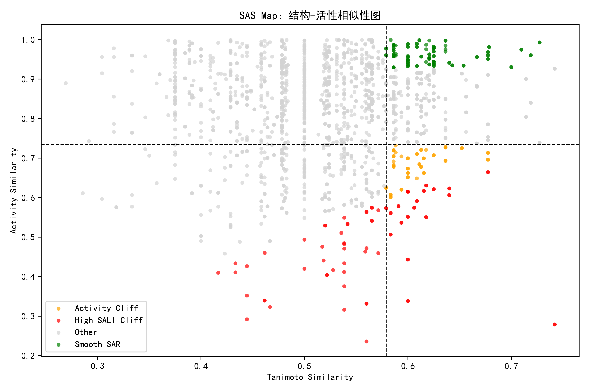
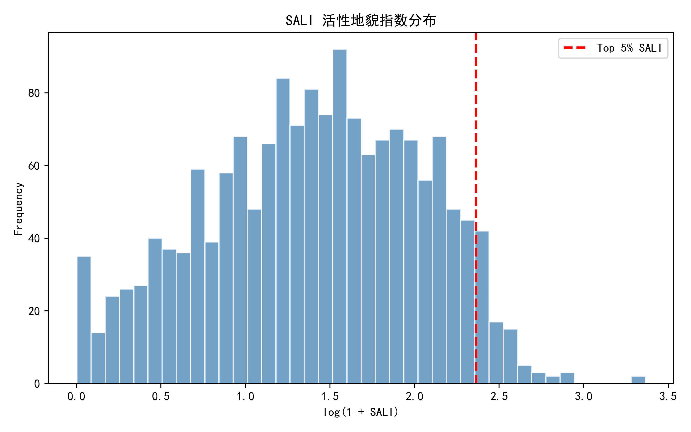
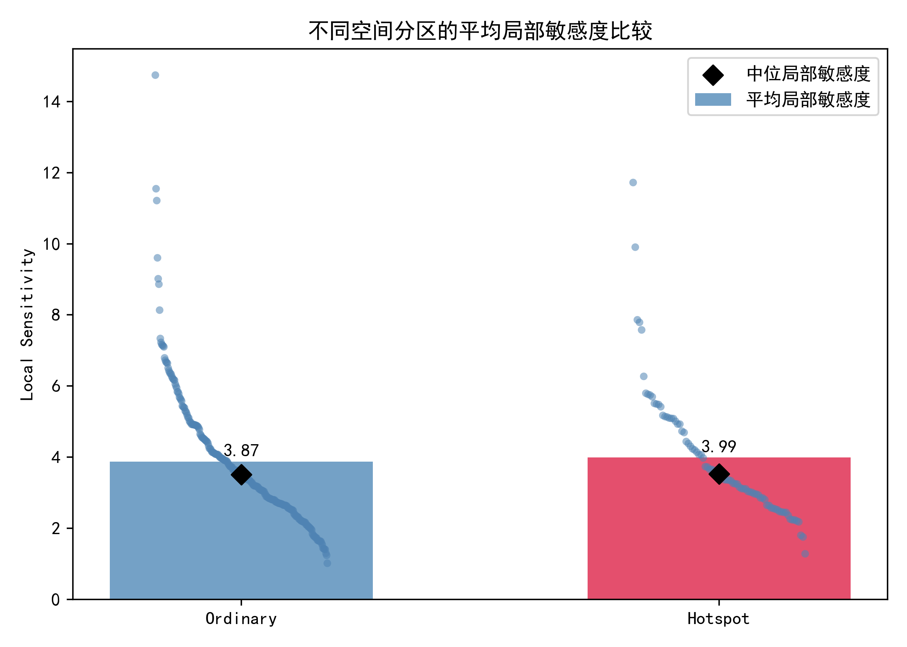
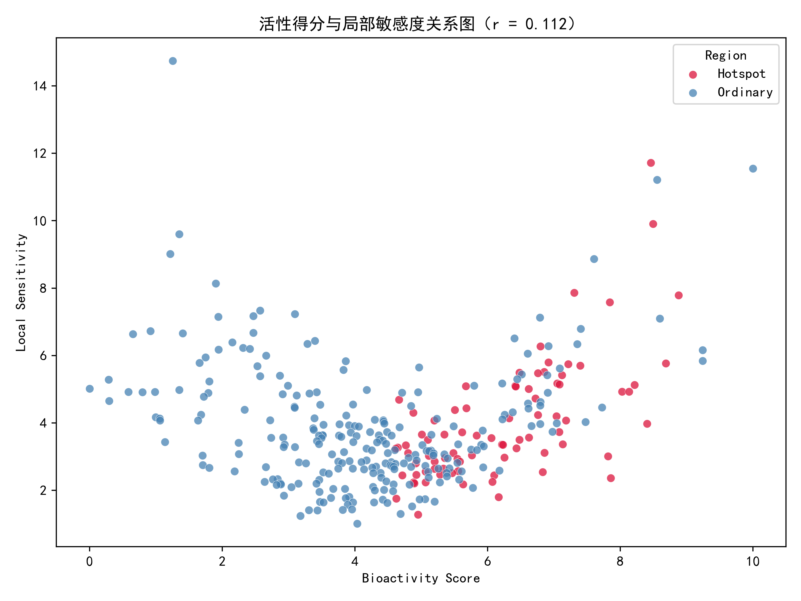

# 第二部分：问题二的求解

## 2.1 问题分析

问题二要求在分子相似关系网络中识别活性悬崖现象，并进一步刻画单个分子在其局部相似邻域内的活性波动程度。所谓活性悬崖，是指两个分子在结构上较为相似，但生物活性差异较大的现象。该现象说明局部结构的小幅变化可能引起活性显著改变，从而反映出较高的结构优化风险。

本题附件 2 已给出分子之间的 KNN 相似图，其中每条边表示一对相似分子，边权为 Tanimoto 结构相似度。因此，本文不再重新计算分子指纹，而是直接利用 KNN 图中的 `Tanimoto_Similarity` 表征分子结构相似程度，并结合附件 1 中的 `Bioactivity_Score` 构建分子对活性悬崖强度指标。在此基础上，进一步将分子对层面的悬崖强度汇总到单个分子层面，建立分子局部敏感度指标。最后，结合第一问得到的热点区域与普通区域划分结果，比较不同空间区域的稳定性差异，并分析高活性与高局部敏感度之间是否存在明显关联。

## 2.2 数据预处理

本题主要使用两个附件数据：

1. 附件 1：`molecular_interaction_manifest.csv`，包含分子编号、二维流形坐标、生物活性得分及若干理化性质；
2. 附件 2：`knn_graph_edges.csv`，包含 KNN 相似图边表，其中 `Source` 和 `Target` 表示相似分子对，`Tanimoto_Similarity` 表示二者结构相似度。

首先读取附件 1 中的分子活性得分，并将其记为

$$
A_i=Bioactivity\_Score_i,
$$

其中 $A_i$ 表示第 $i$ 个分子的生物活性得分。经数据清洗后，共获得有效分子样本 325 个。

对于附件 2 中的每条边 $(i,j)$，读取其 Tanimoto 相似度并记为

$$
sim(i,j)=Tanimoto\_Similarity(i,j).
$$

该指标取值越接近 1，表示两个分子结构越相似。经处理后，共获得有效相似分子对 1625 对。

## 2.3 分子对活性悬崖强度模型

### 2.3.1 活性差异与活性相似度

对于任意一对相似分子 $(i,j)$，首先定义其活性差异为

$$
\Delta A_{ij}=|A_i-A_j|.
$$

为便于在结构相似度与活性相似度平面中进行比较，进一步定义分子对的活性相似度为

$$
S_{Act}(i,j)=1-\frac{|A_i-A_j|}{A_{max}-A_{min}},
$$

其中 $A_{max}$ 和 $A_{min}$ 分别表示全体分子活性得分的最大值和最小值。当两个分子活性差异较小时，$S_{Act}(i,j)$ 接近 1；当活性差异较大时，$S_{Act}(i,j)$ 较低。

### 2.3.2 SALI 活性悬崖指数

为了定量刻画分子对的活性悬崖强度，本文采用结构–活性地貌指数 SALI，定义为

$$
SALI_{ij}=\frac{|A_i-A_j|}{1-sim(i,j)}.
$$

该指标同时考虑活性差异和结构相似性。当两个分子结构越相似时，$1-sim(i,j)$ 越小；若此时二者活性差异较大，则 $SALI_{ij}$ 会显著增大。因此，SALI 越大，说明该分子对越可能构成强活性悬崖。

本文进一步采用分位数阈值识别不同类型分子对。设结构高相似阈值为

$$
sim_{cut}=Q_{0.75}(sim)=0.5789,
$$

活性低相似阈值为

$$
S_{Act,cut}=Q_{0.25}(S_{Act})=0.7348,
$$

则当分子对满足

$$
sim(i,j)\geq sim_{cut},\quad S_{Act}(i,j)\leq S_{Act,cut}
$$

时，将其定义为普通活性悬崖分子对。此外，本文以 SALI 的 95% 分位数作为高强度活性悬崖阈值：

$$
SALI_{cut}=Q_{0.95}(SALI)=9.6204.
$$

当

$$
SALI_{ij}\geq SALI_{cut}
$$

时，将该分子对定义为高 SALI 活性悬崖分子对。

## 2.4 分子对活性悬崖识别结果

根据上述模型，本文对 1625 对相似分子进行计算和分类，结果如下表所示。

| 类型 | 数量 | 含义 |
|---|---:|---|
| Other | 1372 | 普通分子对 |
| Smooth SAR | 114 | 结构相似且活性相似的平滑结构–活性关系 |
| High SALI Cliff | 83 | SALI 最高的前 5% 高强度活性悬崖 |
| Activity Cliff | 56 | 结构相似但活性差异较大的普通活性悬崖 |

由表中结果可知，大多数相似分子对属于普通结构–活性关系，说明整体分子数据中相似结构之间的活性变化以相对平缓为主。但同时仍存在 83 对高 SALI 活性悬崖和 56 对普通活性悬崖，表明局部结构空间中存在一定数量的活性突变现象。

为了直观展示结构相似性与活性相似性之间的关系，绘制 SAS 结构–活性相似性图，如图 4 所示。图中横坐标为 Tanimoto 结构相似度，纵坐标为活性相似度；右下方区域表示结构相似度较高但活性相似度较低的分子对，即典型活性悬崖区域。

图 4 基于 KNN 图的结构–活性相似性图

从图中可以看出，右上方存在一定数量的绿色点，表示结构相似且活性也相似的 Smooth SAR 分子对，说明部分局部结构空间具有较好的稳定性。同时，右下方及其附近存在橙色和红色点，表示结构相似但活性差异较大的活性悬崖分子对，说明数据集中存在局部结构变化引发活性突变的情况。

进一步绘制 SALI 指数分布图，如图 5 所示。由于 SALI 取值跨度较大，本文采用 $\log(1+SALI)$ 进行可视化处理。

图 5 SALI 活性悬崖指数分布

图中红色虚线表示 SALI 前 5% 阈值。可以看出，绝大多数分子对集中在中低 SALI 区域，而右侧仍存在少量高 SALI 分子对，说明整体结构–活性关系以平缓变化为主，但局部区域仍存在显著活性悬崖。该结果为后续识别高敏感分子提供了依据。

部分高 SALI 活性悬崖分子对如下表所示。

| Source | Target | Mol1_ID | Mol2_ID | Mol1_Activity | Mol2_Activity | Tanimoto 相似度 | 活性差异 | SALI | 类型 |
|---:|---:|---:|---:|---:|---:|---:|---:|---:|---|
| 319 | 94 | 319 | 94 | 8.4640 | 1.2551 | 0.7419 | 7.2090 | 27.9347 | High SALI Cliff |
| 94 | 319 | 94 | 319 | 1.2551 | 8.4640 | 0.7419 | 7.2090 | 27.9347 | High SALI Cliff |
| 109 | 297 | 109 | 297 | 8.5581 | 0.9192 | 0.5600 | 7.6389 | 17.3611 | High SALI Cliff |
| 304 | 109 | 304 | 109 | 1.9419 | 8.5581 | 0.6000 | 6.6162 | 16.5405 | High SALI Cliff |
| 109 | 304 | 109 | 304 | 8.5581 | 1.9419 | 0.6000 | 6.6162 | 16.5405 | High SALI Cliff |
| 38 | 297 | 38 | 297 | 7.6039 | 0.9192 | 0.5600 | 6.6847 | 15.1925 | High SALI Cliff |
| 297 | 38 | 297 | 38 | 0.9192 | 7.6039 | 0.5600 | 6.6847 | 15.1925 | High SALI Cliff |
| 111 | 109 | 111 | 109 | 1.7220 | 8.5581 | 0.5385 | 6.8361 | 14.8116 | High SALI Cliff |
| 54 | 110 | 54 | 110 | 1.3527 | 6.9181 | 0.6000 | 5.5653 | 13.9134 | High SALI Cliff |
| 110 | 54 | 110 | 54 | 6.9181 | 1.3527 | 0.6000 | 5.5653 | 13.9134 | High SALI Cliff |

从表中可以看出，高 SALI 分子对通常具有较高的结构相似度，同时活性差异较大。例如分子 319 与分子 94 的 Tanimoto 相似度为 0.7419，但活性得分分别为 8.4640 和 1.2551，活性差异达到 7.2090，SALI 值达到 27.9347，是最典型的活性悬崖分子对。

## 2.5 分子局部敏感度模型

分子对层面的 SALI 指数只能描述两个分子之间的局部突变强度。为了进一步刻画单个分子在其相似邻域内的整体活性波动程度，本文定义分子 $i$ 的相似邻域为

$$
N(i)=\{j:(i,j)\in E\},
$$

其中 $E$ 表示 KNN 相似图中的边集合。基于此，定义分子 $i$ 的局部敏感度为

$$
LS_i=\frac{1}{|N(i)|}\sum_{j\in N(i)}SALI_{ij}.
$$

该指标表示分子 $i$ 与其相似邻居之间平均活性悬崖强度。若 $LS_i$ 较大，说明该分子附近的结构–活性关系较陡峭，小范围结构变化可能引起较大活性波动；若 $LS_i$ 较小，则说明其局部邻域内结构–活性关系较平滑，稳定性较好。

此外，本文还统计每个分子参与活性悬崖的次数 `Cliff_Count`，作为局部敏感性的辅助指标。局部敏感度最高的部分分子如下表所示。

| Index | ID | Bioactivity_Score | Local_Sensitivity | Max_Local_SALI | Neighbor_Count | Cliff_Count | Region |
|---:|---:|---:|---:|---:|---:|---:|---|
| 94 | 94 | 1.2551 | 14.7412 | 27.9347 | 7 | 5 | Ordinary |
| 319 | 319 | 8.4640 | 11.7217 | 27.9347 | 10 | 7 | Hotspot |
| 51 | 51 | 10.0000 | 11.5475 | 12.7438 | 6 | 6 | Ordinary |
| 109 | 109 | 8.5581 | 11.2144 | 17.3611 | 14 | 11 | Ordinary |
| 196 | 196 | 8.4946 | 9.9044 | 11.7596 | 7 | 5 | Hotspot |
| 54 | 54 | 1.3527 | 9.6046 | 13.9134 | 13 | 8 | Ordinary |
| 95 | 95 | 1.2173 | 9.0166 | 12.6089 | 6 | 2 | Ordinary |
| 38 | 38 | 7.6039 | 8.8630 | 15.1925 | 9 | 5 | Ordinary |
| 282 | 282 | 1.9043 | 8.1346 | 11.9974 | 9 | 5 | Ordinary |
| 55 | 55 | 7.3069 | 7.8619 | 11.1684 | 10 | 3 | Hotspot |

由表中结果可以看出，局部敏感度较高的分子既包含低活性分子，也包含高活性分子。例如分子 94 的活性得分仅为 1.2551，但局部敏感度达到 14.7412；分子 319 的活性得分为 8.4640，局部敏感度也达到 11.7217。这说明局部敏感性并不完全由分子本身活性高低决定，而更多反映其相似邻域内结构–活性地貌的陡峭程度。

## 2.6 不同空间分区的稳定性比较

为了结合第一问的空间分区结果，本文将第一问得到的 `Hotspot` 与 `Ordinary` 区域标签合并到分子局部敏感度结果中，并分别统计不同区域的平均活性、平均局部敏感度和参与活性悬崖次数。

| 区域 | 分子数 | 平均活性 | 平均局部敏感度 | 中位局部敏感度 | 平均参与悬崖次数 |
|---|---:|---:|---:|---:|---:|
| Hotspot | 82 | 6.2061 | 3.9907 | 3.5296 | 0.9878 |
| Ordinary | 243 | 4.1201 | 3.8726 | 3.5109 | 0.8107 |

由表中结果可知，热点区域的平均活性显著高于普通区域，这与第一问结论一致。从局部敏感度看，热点区域的平均局部敏感度为 3.9907，普通区域为 3.8726，热点区域略高于普通区域；但两者的中位局部敏感度分别为 3.5296 和 3.5109，差异较小。这说明热点区域虽然具有更高活性，但其整体稳定性并未显著低于普通区域。

为了更直观地比较不同空间分区的局部敏感度，绘制不同区域平均局部敏感度柱状图，如图 6 所示。柱子表示区域平均局部敏感度，黑色菱形表示中位局部敏感度，散点表示区域内单个分子的局部敏感度。

图 6 不同空间分区的平均局部敏感度比较

从图中可以看出，热点区域的平均局部敏感度略高于普通区域，但差异并不明显；同时，普通区域中也存在若干局部敏感度较高的分子，说明高敏感分子并非只分布在高活性热点区。因此，后续候选分子筛选不应仅依据空间区域或活性水平，还应结合单个分子的局部敏感度进行综合判断。

## 2.7 高活性与局部敏感度关联分析

为了分析高活性与高局部敏感度之间是否存在明显关联，本文以分子活性得分 $A_i$ 和局部敏感度 $LS_i$ 为变量，计算 Pearson 相关系数：

$$
r=corr(A_i,LS_i).
$$

计算得到：

$$
r=0.112.
$$

该值接近 0，说明分子活性得分与局部敏感度之间仅存在很弱的正相关关系，并不存在明显线性关联。进一步绘制活性得分与局部敏感度关系图，如图 7 所示。

图 7 活性得分与局部敏感度关系

图中横坐标表示分子活性得分，纵坐标表示局部敏感度，点的颜色表示第一问得到的空间区域标签。可以看出，热点区域分子主要分布在较高活性区间，但其局部敏感度差异较大；普通区域中也存在若干局部敏感度较高的分子。整体点云没有明显单调上升趋势，与相关系数 $r=0.112$ 的结果一致。

因此，高活性分子并不必然对应高局部敏感度。换言之，在高活性分子中仍可能筛选出局部敏感度较低、结构–活性关系较稳定的候选分子；同时，低活性或普通区域中也可能存在局部敏感度较高的风险分子。这一结论为第三问中综合考虑活性、敏感性和多样性的候选分子优选提供了依据。

## 2.8 本题结论

综上，本文基于 KNN 相似图构建了分子对活性悬崖强度指标和单分子局部敏感度指标。首先，利用 Tanimoto 相似度和 Bioactivity Score 计算分子对活性差异、活性相似度以及 SALI 指数，并以 SALI 作为分子对悬崖强度度量。计算结果显示，在 1625 对有效相似分子对中，共识别出 83 对高 SALI 活性悬崖和 56 对普通活性悬崖，说明数据集中存在一定数量结构相似但活性差异显著的局部突变现象。

其次，本文将分子对层面的 SALI 指数汇总到单个分子层面，定义局部敏感度 $LS_i$，用于衡量分子在其相似邻域内因小范围结构变化引起活性波动的程度。结果表明，部分分子具有较高局部敏感度，例如分子 94、319、51 和 109 等，这些分子所在局部邻域结构–活性关系较陡峭，可能具有较高研发风险。

最后，结合第一问的空间分区结果，热点区域的平均局部敏感度为 3.9907，略高于普通区域的 3.8726，但中位局部敏感度差异较小，说明热点区域虽具有较高活性，但并未表现出显著更高的不稳定性。进一步相关性分析得到活性得分与局部敏感度的 Pearson 相关系数为 0.112，表明高活性与高局部敏感度之间不存在明显强关联。因此，在后续分子优选中，应避免仅依据高活性进行筛选，而应综合考虑活性水平、局部敏感度和空间多样性，优先选择高活性且局部敏感度较低的稳健分子。
